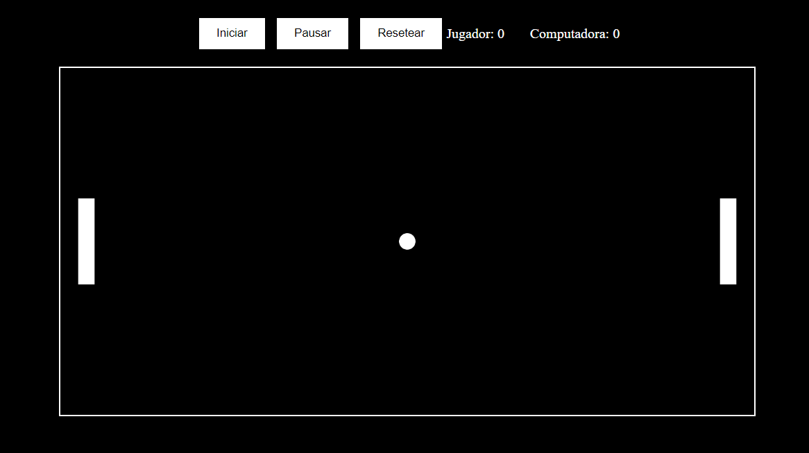

# Game Pong App - Carlos Espipliego

Game Pong App es un sencillo juego de Pong implementado con JavaScript y p5.js. El proyecto permite a los jugadores disfrutar de un clásico juego de Pong, con la funcionalidad de pausar y reanudar el juego y controlar la raqueta del jugador usando las flechas del teclado.

## Tabla de contenidos

- [Visión general](#visión-general)
  - [Descripción](#descripción)
  - [Capturas de pantalla](#capturas-de-pantalla)
  - [Enlaces](#enlaces)
- [Mi proceso](#mi-proceso)
  - [Construido con](#construido-con)
  - [Lo que aprendí](#lo-que-aprendí)
  - [Desarrollo continuo](#desarrollo-continuo)
  - [Recursos útiles](#recursos-útiles)
- [Autor](#autor)
- [Agradecimientos](#agradecimientos)
- [Instrucciones de instalación](#instrucciones-de-instalación)

## Visión general

### Descripción

Game Pong App es un juego clásico de Pong en el que el jugador puede controlar su raqueta con las flechas del teclado y pausar/reanudar el juego con la tecla de espacio. La raqueta de la computadora se mueve automáticamente para desafiar al jugador. Este proyecto fue hecho 100% con ChatGPT con fines educativos como parte del curso de Alura Latam + Oracle One Education "ChatGPT y JavaScript: construyendo el juego Pong".

En esta aplicación, los usuarios pueden:
- Iniciar el juego.
- Pausar y reanudar el juego.
- Mover la raqueta del jugador con las teclas de flecha arriba y abajo.
- Competir contra una raqueta controlada por la computadora.

### Capturas de pantalla



### Enlaces

- URL del repositorio: [Game Pong App](https://carlos-espipliego.github.io/game-pong-app/)

## Mi proceso

### Construido con

- JavaScript
- p5.js
- Chat GPT-4o

### Lo que aprendí

Durante este proyecto, aprendí a:
- Implementar la lógica de un juego clásico de Pong.
- Manejar eventos de teclado para controlar elementos del juego.
- Implementar funcionalidad de pausa y reanudar en el juego.

### Desarrollo continuo

En el futuro, me gustaría:
- Mejorar la inteligencia de la raqueta de la computadora.
- Añadir efectos visuales y sonidos.
- Implementar niveles de dificultad.

### Recursos útiles

- [p5.js Reference](https://p5js.org/reference/) - La referencia de p5.js me ayudó a entender cómo utilizar las funciones y métodos de la biblioteca.
- [MDN Web Docs](https://developer.mozilla.org/) - La documentación de MDN es un recurso excelente para aprender sobre JavaScript y la manipulación del DOM.

## Autor

- Github - [@CarlosEspipliego](https://github.com/carlos-espipliego)

## Agradecimientos

Gracias a Alura Latam y Oracle One Education por la oportunidad de participar en este curso. Agradezco también a la comunidad de p5.js por proporcionar una biblioteca tan útil para crear visualizaciones y juegos interactivos.

## Instrucciones de instalación

Para ejecutar este proyecto localmente, sigue estos pasos:

1. **Clona el repositorio**:

    ```bash
    git clone https://github.com/carlos-espipliego/game-pong-app.git
    cd game-pong-app
    ```

2. **Abre el archivo `index.html` en tu navegador**:

    Simplemente abre el archivo `index.html` en tu navegador preferido para iniciar el juego.

    ¡Listo! Ahora puedes disfrutar del juego Pong. 🚀
